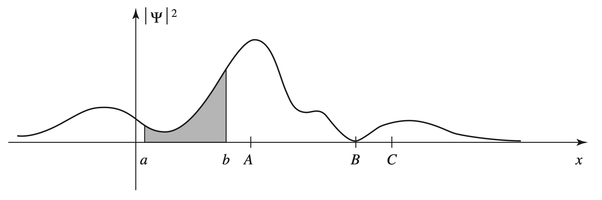
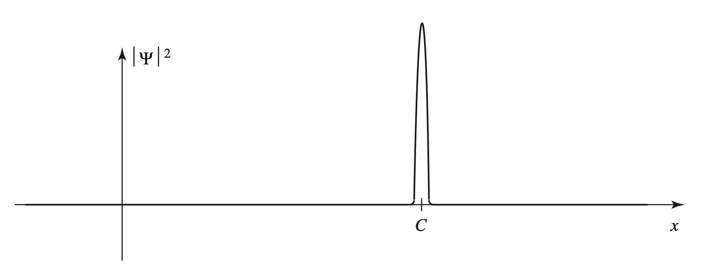

## Schrödinger 方程与波函数

$$
\begin{equation}
  i\hbar\frac{\partial\Psi}{\partial t}=\frac{\hbar^{2}\partial^{2}\Psi}{2m\partial x^{2}}+V\Psi.
\end{equation}
$$

其中，$\hbar=\frac{h}{2\pi}$ 是 Planck 常量。

在给定适当的初始条件以后（比如 $\Psi(x,0)$）通过求解 Schrödinger 方程可以得到以后任意时刻的波函数 $\Psi (x,t)$。Born 关于波函数的统计诠释指出 $\left|\Psi(x,t)\right|^{2}$ 是在 $t$ 时刻发现粒子位于 $x$ 处位置的几率大小\cite{Born M. Quantenmechanik der stoßvorgänge[J]. Zeitschrift für physik, 1926, 38(11): 803-827.}，即发现粒子在时刻 $t$ 位于位置 $a$ 和 $b$ 之间的概率为

$$
\begin{equation}
\int_{a}^{b}\left|\Psi(x,t)\right|^{2}\mathrm{d}x.
\end{equation}
$$

图 \fig{typical wave function} 是一个典型的波函数，且阴影部分的面积是在某一时刻发现粒子位于位置 $a$ 和 $b$ 之间的概率。显然，根据图像，粒子很有可能被发现在 $A$ 点附近而不是 $B$ 点附近。

\fig{典型的波函数}

如果在某一时刻测量，我们发现粒子位于 $C$ 点，那么波函数会立刻塌缩为图 \fig{collapsed wave function}。

\fig{测量后塌缩的波函数}
